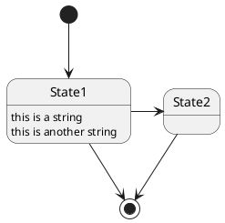

# PegmatiteCustom - Chrome ext to preview PlantUML in markdown

PegmatiteCustom is based on Pegmatite which is Google Chrome extension that replace PlantUML code blocks into preview images.
PegmatiteCustom enables that function in any site which you want by configuration.
( e.g. your local Git Hosting server)

[PegmatiteCustom Chrome web store](https://chrome.google.com/webstore/detail/pegmatite/moljofehkijgeiofdclkpdmckjcbmbee)  

* original Pegmatite site
    * [Code](https://github.com/dai0304/pegmatite)  
    * [Chrome web store](https://chrome.google.com/webstore/detail/pegmatite/moljofehkijgeiofdclkpdmckjcbmbee)

## Summary

| You will see below               | But we see
| -------------------------------- | -------------
|  | 

* This extension is enabled in the whitelisted sites at default
    * `https://github.com/*`
    * `https://gist.github.com/*`
    * `https://gitpitch.com/*`
    * `https://gitlab.com/*`
    * `https://bitbucket.org/*`
    * `https://*.backlog.jp/wiki/*`
* You can add your favorite sites which you want to enable by configuration.
* Replace only code block with lang `uml` and starts with `@start`.
    * lang `puml` or `plantuml` is also supported.
* When the element is double-clicked, element will toggle original code block and preview image.

## Sample contents

### Sequence diagram with lang `uml`

```uml
@startuml
Alice -> Bob: Authentication Request
Bob --> Alice: Authentication Response

Alice -> Bob: Another authentication Request
Alice <-- Bob: another authentication Response
@enduml
```

### State diagram with lang `puml`



### Other code blocks

These cannot preview.

#### Code block without lang `uml`

```
@startuml
Foo -> Bar
@enduml
```

#### `uml` code block does not starts with `@start`

```uml
foo
bar
baz
```

## Using another PlantUML server

By default, Pegmatite uses [PlantUML server](https://github.com/plantuml/plantuml-server)
deployed to `https://www.plantuml.com/plantuml`.

However, if your UML is confidential and you cannot send it to an external server, you can also use any PlantUML server.
Configuring "Base URL" on the setting page, Pegmatite delegates image generation to this server.

Examples.

* `https://www.plantuml.com/plantuml/img/` (default)
* `https://www.plantuml.com/plantuml/svg/`
* `https://any-plantuml-server.example.com:8080/img/`

Also you can run PlantUML server in localhost using Docker as following command:

```
$ docker run -d -p 8080:8080 plantuml/plantuml-server
```

And you can specify `http://localhost:8080/img/` as *Base URL*.

Note: To avoid mixed-content, if the *Base URL* is not HTTPS scheme,
generated image is converted to [DATA URI](https://tools.ietf.org/html/rfc2397).

## Author

* original Pegmatite
    * [Daisuke Miyamoto](https://github.com/dai0304)
* Pegmatite Custom
    * [nanitsuku](https://github.com/nanitsuku/pegmatite)